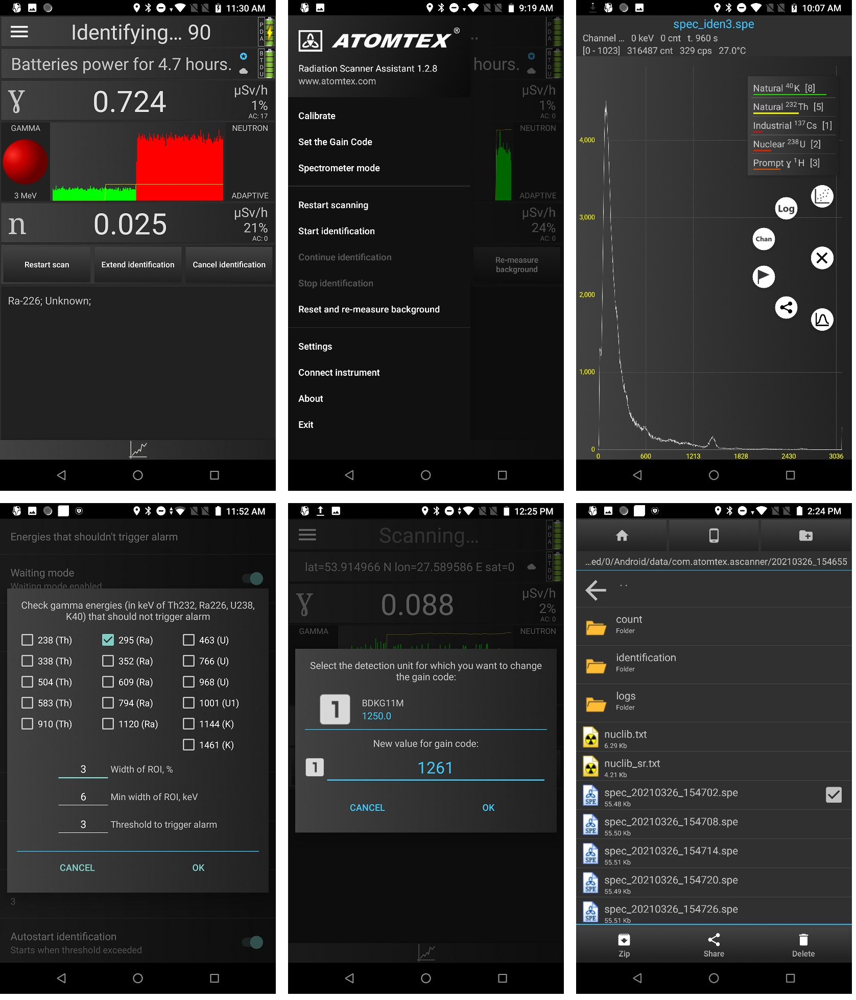

# Radiation Scanner Assistant 1.2.9.24
### <i>The  “Radiation  Scanner  Assistant”  program  is  intended  for  running  on  a smartphone  to  control  and  operate  AT6101C  and  AT6101CM  Backpack-based Radiation Detectors and AT6103 Mobile Radiation Scanning System (hereinafter the device), which are intended for: spectral  radiation  monitoring  of  indoor  and  outdoor  areas  with  geo-referencing, detection  and  identification  of  gamma  radionuclides,  measurement  of ambient gamma radiation dose equivalent rate, detection of neutron radiation sources.</i>   

[RSA Manual eng.pdf](./RSA-manual/Radiation%20Scanner%20Assistant_eng_v2.1.0.pdf)  
[RSA Manual rus.pdf](./RSA-manual/Radiation%20Scanner%20Assistant_rus_v2.1.0.pdf)

[Release notes](./VERSION.md)    
[Список версий](./VERSION_RUS.md)    

